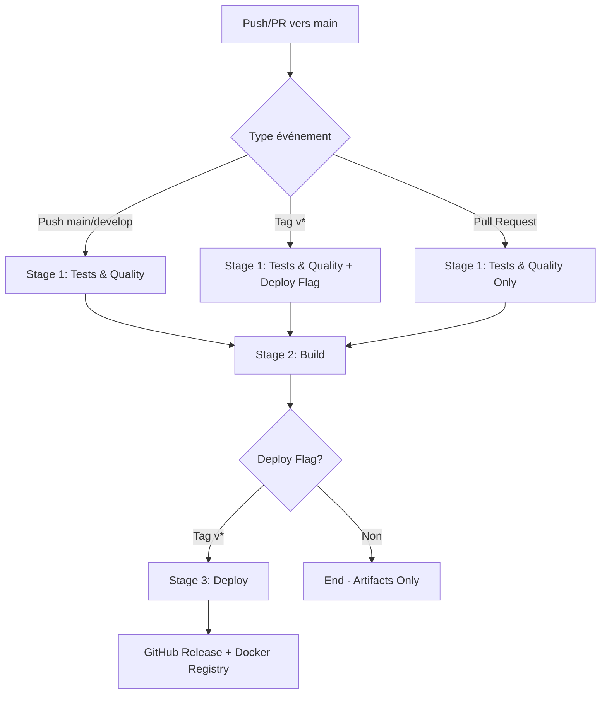
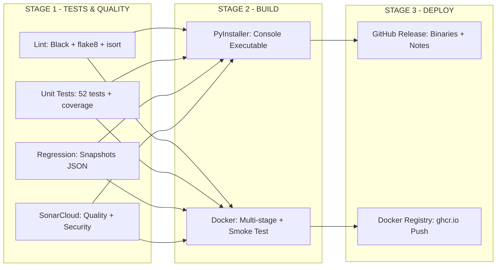
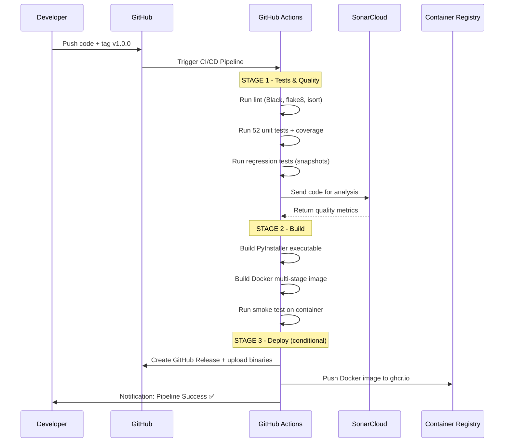
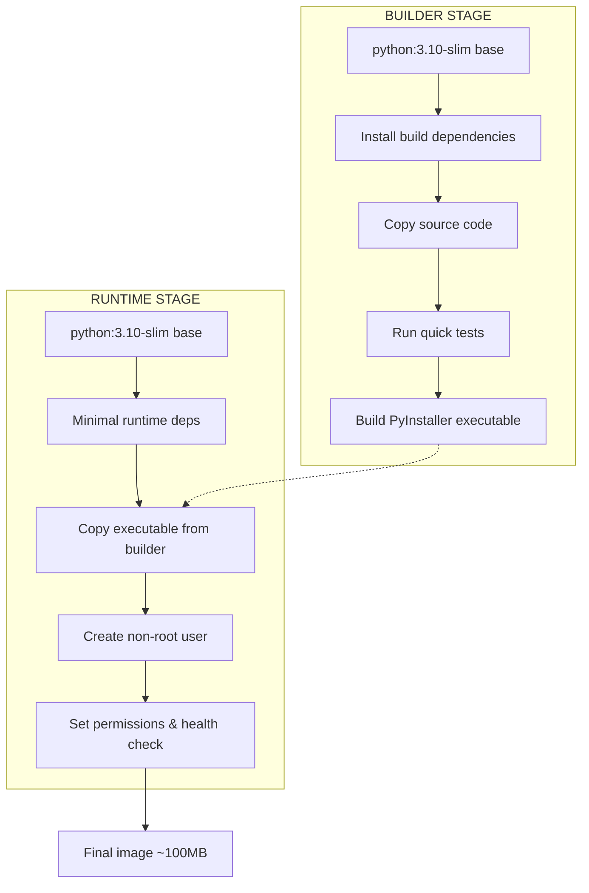
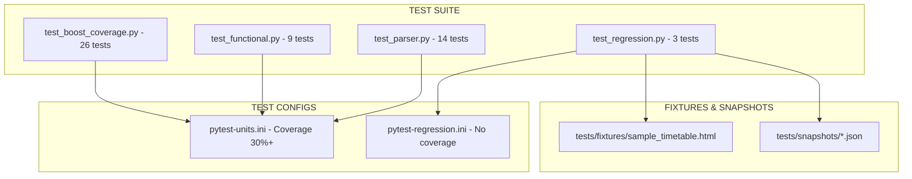
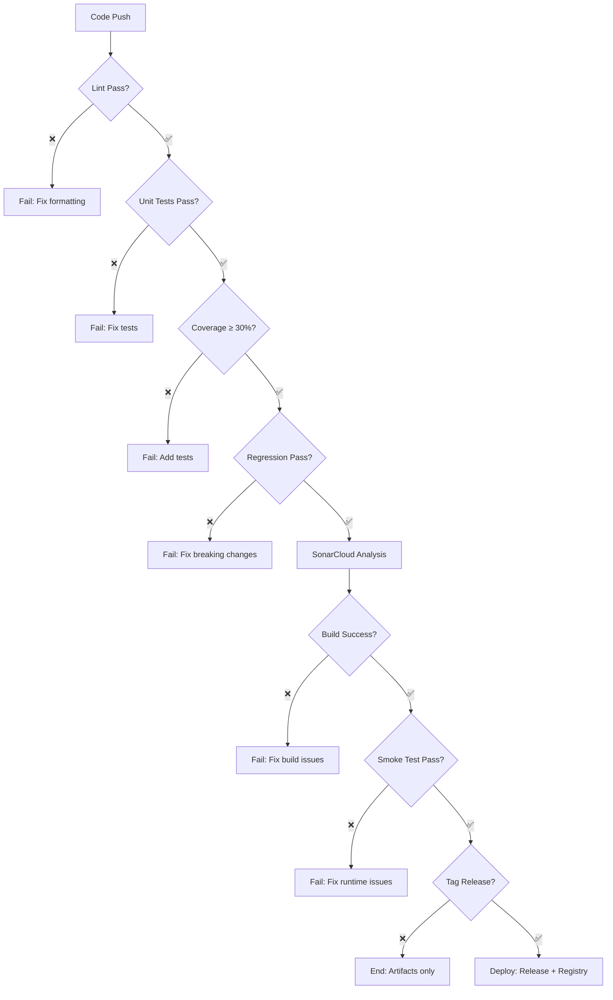

# 🔄 DIAGRAMMES ARCHITECTURE CI/CD

## Pipeline Flow Global

## Architecture 3-Stages Détaillée

## Flux de Données

## Docker Multi-Stage Build

## Tests Architecture

## Quality Gates

---

*Diagrammes générés automatiquement pour pipeline CI/CD Wigor Viewer*