# 🔄 DIAGRAMMES ARCHITECTURE CI/CD

## Pipeline Flow Global

## Architecture 3-Stages Détaillée

## Flux de Données

## Docker Multi-Stage Build

## Tests Architecture

## Quality Gates

```mermaid
graph TD
    A[Code Push] --> B{Lint Pass?}
    B -->|❌| B1[Fail: Fix formatting]
    B -->|✅| C{Unit Tests Pass?}
    
    C -->|❌| C1[Fail: Fix tests]  
    C -->|✅| D{Coverage ≥ 30%?}
    
    D -->|❌| D1[Fail: Add tests]
    D -->|✅| E{Regression Pass?}
    
    E -->|❌| E1[Fail: Fix breaking changes]
    E -->|✅| F[SonarCloud Analysis]
    
    F --> G{Build Success?}
    G -->|❌| G1[Fail: Fix build issues]
    G -->|✅| H{Smoke Test Pass?}
    
    H -->|❌| H1[Fail: Fix runtime issues]  
    H -->|✅| I{Tag Release?}
    
    I -->|❌| J[End: Artifacts only]
    I -->|✅| K[Deploy: Release + Registry]
```

---

*Diagrammes générés automatiquement pour pipeline CI/CD Wigor Viewer*