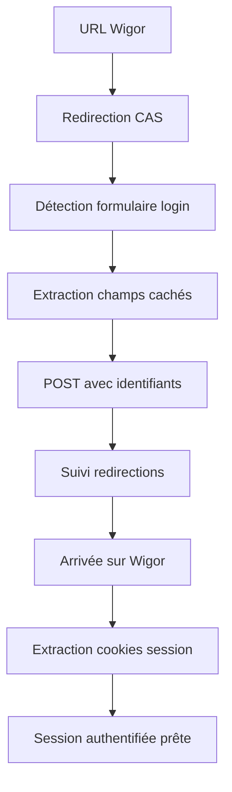

## 🏗️ Architecture technique

### Structure du projet
```
wigor_viewer/
├── 📁 src/                          # Code source principal
│   ├── 📄 main.py                   # Point d'entrée CLI avec modes GUI/test  
│   ├── 📄 gui.py                    # Interface Tkinter avec auth automatique
│   ├── 📄 wigor_api.py             # Client HTTP + login_with_credentials()
│   └── 📄 timetable_parser.py      # Parser HTML emploi du temps
├── 📁 auth/                         # Modules d'authentification  
│   └── 📄 cookies_auth.py          # Gestion sessions et cookies
├── 📁 tests/                        # Suite de tests
│   └── 📄 test_parser.py           # 14 tests unitaires du parser
├── 📄 run.py                       # Launcher simplifié  
├── 📄 test_integration.py          # Tests d'intégration (6 tests)
├── 📄 README.md                    # Documentation principale
├── 📄 GUIDE_UTILISATION.md         # Guide détaillé utilisateur
└── 📄 NOUVELLES_FONCTIONNALITES.md # Changelog v2.0
```

### Flux d'authentification CAS


## 🆕 Nouveautés v2.0

### Authentification automatique
- **🔑 Fonction `login_with_credentials()`** : Authentification complète avec identifiants
- **🕵️ Détection automatique CAS** : Analyse des formulaires et redirections
- **🔐 Gestion champs cachés** : Extraction automatique `lt`, `execution`, `_eventId`
- **🔄 Suivi redirections intelligentes** : JavaScript et meta refresh
- **🍪 Extraction cookies** : Récupération automatique des sessions

### Interface utilisateur améliorée
- **👤 Champs identifiant/mot de passe** : Saisie directe des credentials EPSI
- **🔘 Bouton d'authentification** : "Se connecter avec identifiants"  
- **📊 Indicateurs de statut** : Feedback visuel en temps réel
- **🎨 Organisation claire** : Sections séparées pour chaque méthode d'auth

### Robustesse et debugging
- **📝 Logging amélioré** : Traçage détaillé de chaque étape d'authentification
- **💾 Sauvegarde debug HTML** : Pages téléchargées avec timestamps
- **⚡ Gestion d'erreurs** : Messages utilisateur clairs et codes HTTP
- **🔄 Fallback gracieux** : Retour aux cookies manuels si échec

## 🔧 API et fonctions clés

### Nouvelles fonctions d'authentification

```python
# Authentification automatique principale  
def login_with_credentials(username: str, password: str, url: str) -> Dict:
    """
    Se connecte automatiquement à Wigor avec identifiants EPSI.
    
    Args:
        username: Identifiant EPSI (ex: prenom.nom)
        password: Mot de passe EPSI
        url: URL de l'emploi du temps Wigor
        
    Returns:
        Dict avec success, session, cookies_string, error, status_code
    """

# Fonctions utilitaires internes
def _find_login_form(html: str) -> Optional[BeautifulSoup]:
    """Détecte le formulaire de connexion CAS dans la page."""

def _extract_form_data(form: BeautifulSoup) -> Dict[str, str]:
    """Extrait tous les champs du formulaire (visibles + cachés)."""

def _extract_cookies_string(session: requests.Session) -> str:
    """Convertit les cookies de session en string utilisable."""
```

### Interface graphique étendue

```python
class WigorViewerGUI:
    def __init__(self, root):
        # ... widgets existants ...
        
        # 🆕 Nouveaux widgets d'authentification
        self.username_entry: tk.Entry        # Champ identifiant
        self.password_entry: tk.Entry        # Champ mot de passe (show="*")  
        self.login_button: tk.Button         # Bouton connexion automatique
        self.status_label: tk.Label          # Affichage statut temps réel
    
    def _login_with_credentials(self):       # 🆕 Nouvelle méthode
        """Lance l'authentification automatique avec identifiants."""
```

## 🎯 Avantages de la v2.0

### Pour l'utilisateur
- ✅ **Plus simple** : Juste identifiant + mot de passe, comme sur le site EPSI
- ✅ **Plus sécurisé** : Pas de manipulation manuelle des cookies
- ✅ **Plus rapide** : Authentification et remplissage automatique des cookies
- ✅ **Plus fiable** : Gestion automatique des tokens CAS et redirections

### Pour le développeur  
- ✅ **Code modulaire** : Fonctions utilitaires réutilisables
- ✅ **Debugging facilité** : Logs détaillés et sauvegarde HTML
- ✅ **Tests robustes** : Couverture des nouveaux composants
- ✅ **Compatibilité** : Support des deux méthodes d'authentification

## 🚧 Roadmap future

### v2.1 - Améliorations UX
- [ ] **Cache local** des emplois du temps pour mode hors-ligne
- [ ] **Mémorisation sécurisée** des identifiants (keyring)
- [ ] **Auto-refresh** périodique de l'emploi du temps
- [ ] **Notifications** de changements détectés

### v2.2 - Fonctionnalités avancées  
- [ ] **Export calendrier** (iCal, Google Calendar, Outlook)
- [ ] **Mode multi-utilisateurs** (plusieurs emplois du temps)
- [ ] **Thèmes visuels** personnalisables (sombre, clair, coloré)
- [ ] **Widget desktop** pour accès rapide

### v2.3 - Intégrations
- [ ] **API REST** pour développements tiers
- [ ] **Plugin VSCode** pour développeurs EPSI  
- [ ] **App mobile** (via framework comme Kivy)
- [ ] **Synchronisation cloud** des préférences

## 📞 Support et contribution

### Signaler un problème
1. **Vérifier les prérequis** : Python 3.7+, dépendances installées
2. **Tester manuellement** : Connexion sur wigor.net avec mêmes identifiants  
3. **Lancer les tests** : `python test_integration.py`
4. **Consulter les logs** : Mode debug avec `python src/main.py --test --verbose`
5. **Créer une issue** avec logs et description détaillée

### Développement local
```bash
# Clone et setup
git clone <repo>
cd wigor_viewer

# Tests complets
python test_integration.py
python -m pytest tests/ -v --cov=src

# Mode debug
python src/main.py --test --verbose
```

### Contribution
- 🍴 **Fork** le projet
- 🌿 **Créer une branche** pour votre fonctionnalité  
- ✅ **Ajouter des tests** pour votre code
- 📝 **Documenter** les changements
- 🔄 **Soumettre une Pull Request**

---

**Wigor Viewer v2.0** - Simplifie l'accès aux emplois du temps EPSI avec une authentification automatique moderne ! 🚀